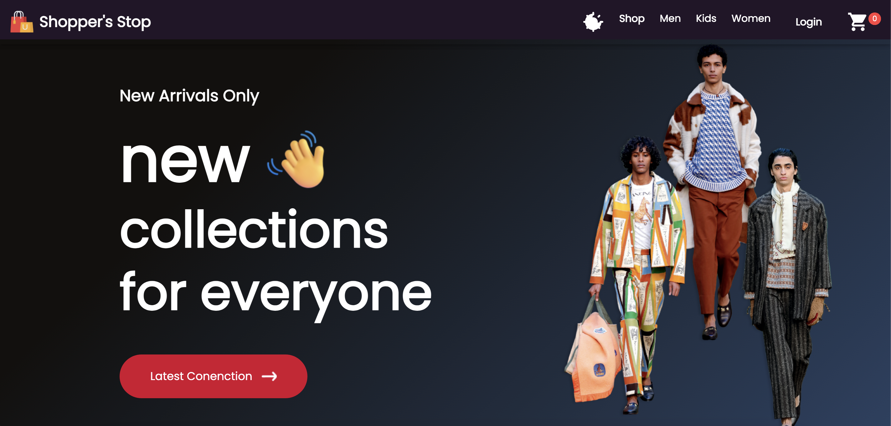

# Shopper's Stop
This is the web application for Shopper's Stop e-commerce store.

## Table of Contents

- [Shopper's Stop](#shoppers-stop)
  - [Table of Contents](#table-of-contents)
  - [Overview](#overview)
    - [Features](#features)
    - [Screenshot](#screenshot)
  - [Technologies Used](#technologies-used)
  - [Application Architecture](#application-architecture)
    - [Project Structure](#project-structure)
  - [Integration](#integration)
  - [Contributing](#contributing)
    - [Contribution Guide](#contribution-guide)
    - [Installation Guide](#installation-guide)

## Overview

### Features
Users should be able to: 
- Browse products according to categories - Men, Women or Kids.
- Signup or Login on landing page.
- Add items to shopping cart.
- Switch application interface between light and dark mode.

### Screenshot


## Technologies Used
- React
- TailwindCSS

## Application Architecture

### Project Structure
This repository has the following structure:

```text
  ├── node_modules                # Contains external dependencies of the project
  ├── public                      # Data for site metadata and static blog such as images
  ├── src                         # Contains source code for app
  │    ├── components             # Contains the folder for app's assets and individual custom components used throughout app.
  │    ├── context                # Contains context states used in website
  │    ├── pages                  # Application's pages source. It includes raw markdown files and React page templates.
  │    ├── App.css                # Contains global CSS styles for formatting app
  │    ├── App.jsx                # Contains main UI logic for app
  │    ├── index.css              # Stylesheet for base styles
  │    └── index.js               # Project entry point
  ├── .gitignore                  # Contains list of intentionally untracked files
  ├── package-lock.json           # Contains the locked down version of every package and dependencies installed in project
  ├── package.json                # Contains human-readable metadata and list of dependencies required by the project
  ├── README.md                   # Contains documentation for the project
  └── tailwind.config.js          # TailwindCSS configuration file
```

## Integration
This web application can run on any device with a web browser.

## Contributing

### Contribution Guide
"Fork and Branch" workflow is strongly recommended. Follow these steps:
1. Fork a GitHub repository.
   
2. Clone the forked repository to your local system.
   
3. Connect your local to the original repository by adding remote.
    ```sh
        git remote add upstream git@github.com:imadityayadav/frontend.git
    ```    
   
4. Create a feature branch in which to place your changes.
   
5. Pull in changes from "upstream" often to reduce the likelihood of merge conflicts.
    ```sh
        git pull upstream main
    ```    

6. Make your changes to the new branch.
   
7. Commit the changes to the branch.

8. Push the branch to GitHub.
   
9.  Open a pull request from the new branch to the original repo.
    
10. Clean up after your pull request is merged

### Installation Guide

1. Install the required packages.
    ```sh
    npm install
    ```

2. Start the development server.
    ```sh
    npm start
    ```
3. Open project in browser by clicking on the generated link or paste this link - https://shopperstop-iota.vercel.app/ in browser

Contributions are welcome! If you have any suggestions or find any issues, please feel free to raise an issue and follow the guideline as much as possible to ensure consistency.
